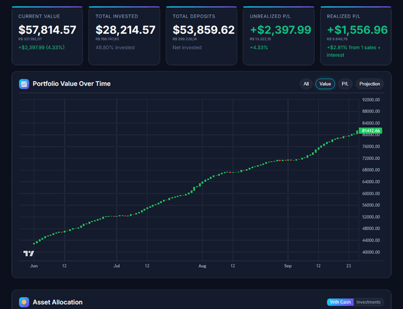
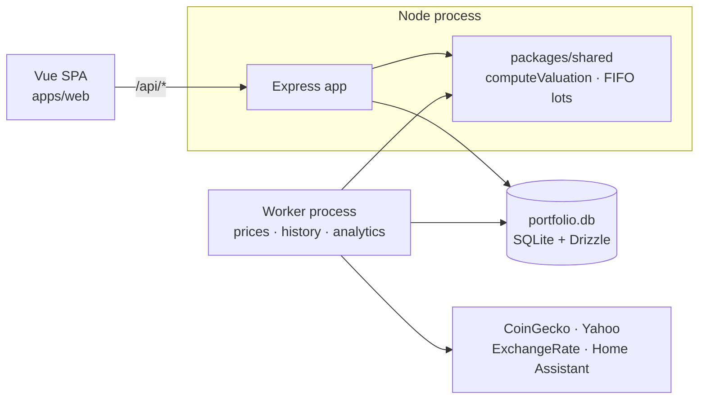

# Portfolio Dashboard

A personal portfolio tracker: holdings, cash, trades and performance analytics for a
multi-currency book (USD, BRL, crypto, equities, ETFs), with price alerts, a
what-if simulator, and scheduled history/analytics snapshots.



The demo above is not a mock-up. It is the real app, screenshotted by
`npm run demo:build` against the committed fixture, with prices synthesised from
the fixture's own buy prices (see [the script](scripts/build-demo-gif.mjs)).

## Why it exists

Three things motivated building it, and all three are visible in the code:

1. **Most portfolio trackers assume a single currency and no basis.** A BRL-denominated
   holding is stored in USD, quoted in BRL, and its _return_ depends on the FX rate
   at purchase — so every number here carries the currency it is in, and the
   conversion happens in exactly one place.
2. **"What if I had sold last year?" needs a real FIFO walk.** The simulator replays
   trades through the same lot logic the server uses, so a scenario cannot disagree
   with history.
3. **The interesting numbers should be computed once.** The dashboard, the API's
   history snapshots and the analytics service all call the same `computeValuation`
   in `packages/shared`. Two copies of one rule drift, and the drift only shows up
   as a chart that disagrees with the number above it.

## Tech stack

| Layer     | Choice                                                      | Why                                                                                                                                           |
| --------- | ----------------------------------------------------------- | --------------------------------------------------------------------------------------------------------------------------------------------- |
| Frontend  | Vue 3 (Composition API, `<script setup>`), TypeScript, Vite | Three pages, a 400-line store each; the migration was done by strangler pattern so the app was never broken mid-move                          |
| Charts    | Chart.js, lightweight-charts                                | Doughnut and line charts, plus candlesticks for the per-asset views                                                                           |
| Backend   | Node 22, Express 4, TypeScript                              | Small, boring, and the whole API is ~20 route modules                                                                                         |
| Database  | SQLite via Drizzle ORM                                      | One file, one writer, no server to operate — appropriate for a single-user app                                                                |
| Contracts | OpenAPI 3 → generated TypeScript                            | `npm run api:types` regenerates `paths`; a route that drifts from the spec fails the contract test, and a payload that drifts fails `vue-tsc` |
| Tests     | Vitest (unit + jsdom), Playwright (browser)                 | One runner for API, web and shared; six smoke tests that drive the built bundle                                                               |
| Quality   | ESLint 9 flat config, Prettier, five-job CI                 | A PR cannot merge with an unused import, an unformatted file or a red image                                                                   |
| Telemetry | OpenTelemetry → SigNoz                                      | Request spans on the existing endpoints; no vendor lock-in in the code                                                                        |

## Architecture



One database, two processes: the web process serves HTTP, the worker runs the
scheduled jobs. Both use the domain logic in `packages/shared`, so a snapshot
written at 3pm and a dashboard rendered at 3:01pm are computed by the same code.
See [docs/ARCHITECTURE-OVERVIEW.md](docs/ARCHITECTURE-OVERVIEW.md) for the
schema, the caching layers and the scaling path.

## Quick start

```bash
git clone https://github.com/<you>/portfolio-dashboard.git
cd portfolio-dashboard
npm install
npm run seed:local        # import the synthetic fixture into an empty database
npm run dev               # http://localhost:3000
```

Migrations run automatically on first start. `npm run seed:local` is optional —
without it you get an empty portfolio, and the pages render their empty states.

With Docker, sample data included:

```bash
docker compose -f docker-compose.local.yml up -d --build
```

To work on the frontend with hot reload (proxies `/api` to `:3000`):

```bash
npm run dev:web           # http://localhost:5173
```

## Development

| Command                                 | What it does                                           |
| --------------------------------------- | ------------------------------------------------------ |
| `npm run dev`                           | API with hot reload, on `:3000`                        |
| `npm run dev:web`                       | Vite dev server, on `:5173`                            |
| `npm run build`                         | shared → API → web                                     |
| `npm test`                              | Vitest across all three workspaces (408 tests)         |
| `npm run test:coverage`                 | …with coverage against the 80% gate                    |
| `npm run test:e2e`                      | Playwright smoke tests (needs a build first)           |
| `npm run lint` / `npm run format:check` | ESLint and Prettier                                    |
| `npm run check`                         | everything CI verifies, in one command                 |
| `npm run scan:secrets`                  | asserts no data or credential ever entered git history |
| `npm run demo:build`                    | regenerates the GIF above from the real app            |
| `npm run api:types`                     | regenerate the typed client from `openapi.yaml`        |
| `npm run db:generate`                   | generate a Drizzle migration after editing `schema.ts` |

Two processes, one database. In development `npm run dev` starts only the web
process; the worker is a separate entry point (`npm run start:worker`) because the
scheduled jobs are the part you least want running while you are editing.

## API

- `apps/api/openapi.yaml` is the contract; Swagger UI is at `/api/docs`.
- `GET /api/portfolio/valuation?cash=with-cash|investments` is the one to read first:
  it returns totals, invested cost, realized and unrealized P/L, one row per
  position and per cash balance, and the allocation split — all computed
  server-side, with each amount stating the currency it is in.
- A trade creates a matching cash entry, so the cash ledger and the trade list can
  never disagree.
- The SQL Explorer is closed unless `ENABLE_SQL_EXPLORER=true`; it is arbitrary SQL
  over the database, and that is not something to ship open by default.

More in [docs/BACKEND.md](docs/BACKEND.md).

## What I'd do differently

This repository is the product of migrating a working app rather than writing a new
one, and the seams show. In rough order of how much they cost:

- **The strangler pattern was the right call and I would do it again**, but the
  redirect map (`migratedPages` in `app.ts`) and the `LegacyHandoff` card existed
  for two phases and are now nearly dead code. A rewrite would have been faster
  overall for four pages; the pattern earns its keep when the legacy surface is
  bigger than this one was.
- **The test suite arrived too late.** For six phases, "does it still work?" meant
  opening the page and reading the numbers. Phase 7 added Vitest and Playwright,
  which immediately found a live bug (`request()` swallowed network failures) that
  several careful manual passes had missed. Unit tests for the Pinia stores should
  have been written alongside the first component, not after the last one.
- **Two database defects sat in `POST /api/state/import` for the whole life of the
  app**: it wrote a column dropped years earlier, so every restore failed; and
  `interest` has no unique key, so restoring a backup _doubled_ every interest
  month. Neither was a design error — they were code nobody ran. The fix was two
  lines each, found only by testing the restore path against itself.
- **`packages/shared` should have existed on day one.** The money helpers and the
  FIFO walk were duplicated in three files before Phase 2 moved them, and the
  dashboard spent Phase 6 deleting a second copy of the valuation rules it had
  written in Phase 5.
- **SQLite was the right call and is also the ceiling.** A single file with a
  single writer is exactly right for one person's portfolio, and it removes an
  entire class of operational work. It also means the history snapshot job cannot
  overlap with a heavy export, and the write path is serialised. If this ever
  served more than one user, Postgres is the first change — the Drizzle schema
  would carry over unchanged, which is the main reason to use an ORM here.
- **Alerting by webhook was under-designed.** The alert engine evaluates
  thresholds and posts to Home Assistant, but there is no record of _why_ an alert
  fired beyond the current and previous price. A small `alert_events` table would
  make the history of the portfolio much easier to explain.

## Documentation

| Document                                                       | For                                                                                       |
| -------------------------------------------------------------- | ----------------------------------------------------------------------------------------- |
| [AGENTS.md](AGENTS.md)                                         | Conventions, architecture and the pitfalls list — read this before changing anything      |
| [docs/ARCHITECTURE-OVERVIEW.md](docs/ARCHITECTURE-OVERVIEW.md) | Schema, caching, processes, scaling path                                                  |
| [docs/BACKEND.md](docs/BACKEND.md)                             | API behaviour, the two-process model, deployment notes                                    |
| [docs/SERVER-SETUP.md](docs/SERVER-SETUP.md)                   | Ubuntu, Docker and Dokploy deployment                                                     |
| [docs/HOME_ASSISTANT_SETUP.md](docs/HOME_ASSISTANT_SETUP.md)   | Alert notifications                                                                       |
| [docs/MODERNIZATION-PLAN.md](docs/MODERNIZATION-PLAN.md)       | The eight-phase migration, what was decided and why, and the open questions for the owner |
| [e2e/README.md](e2e/README.md)                                 | Browser tests: how to run them and what not to assert                                     |
| [scripts/README.md](scripts/README.md)                         | Benchmarks and the k6 load test                                                           |

## A note on the data

Everything in `fixtures/` is synthetic: 14 invented trades, invented cash
balances, invented snapshots. The real portfolio data that lived in this
repository was removed from **every commit** before it was made public, and
`npm run scan:secrets` checks that on every run — the database, the old backup
directory, the exported JSON, and any credential-shaped string in a tracked file.
If that script ever fails, the answer is not to delete the file; it is to rewrite
the history, because the secret is already in the clone.

## License

MIT — see [LICENSE](LICENSE).
