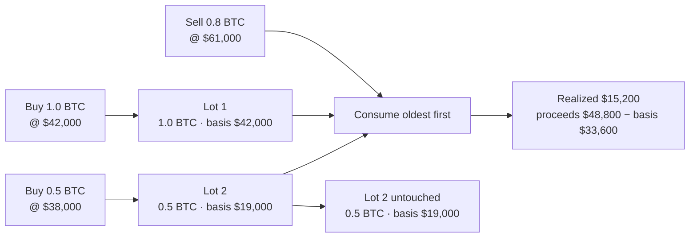
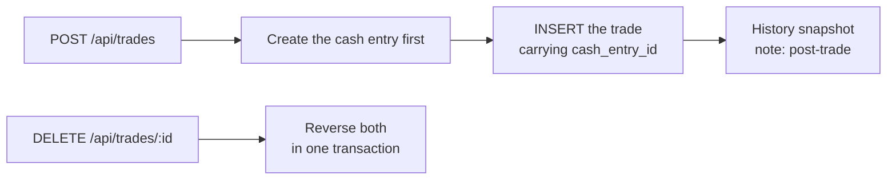
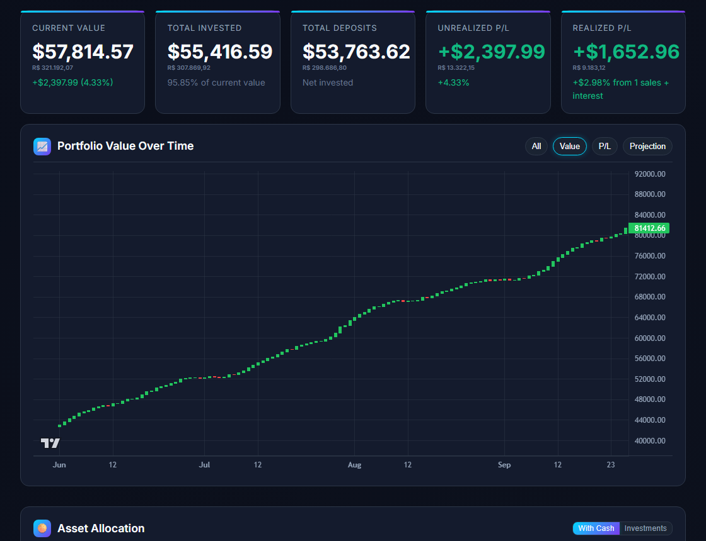
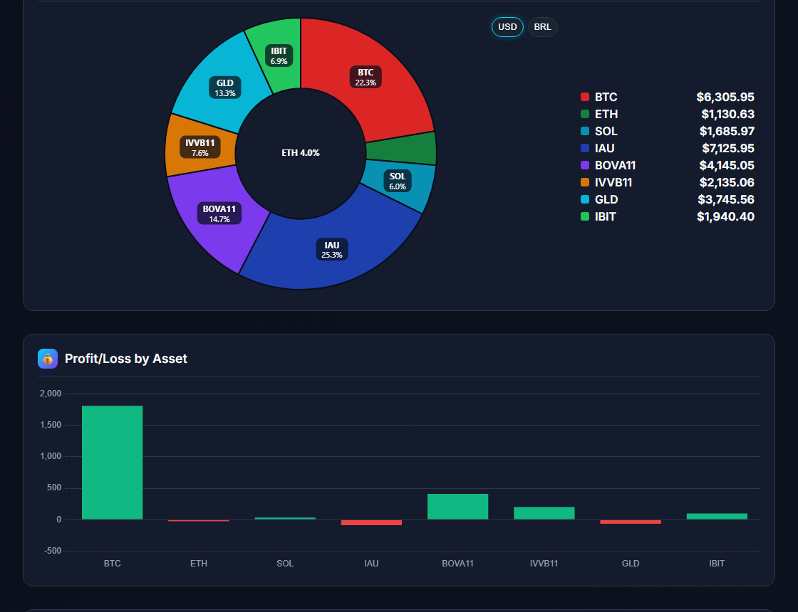
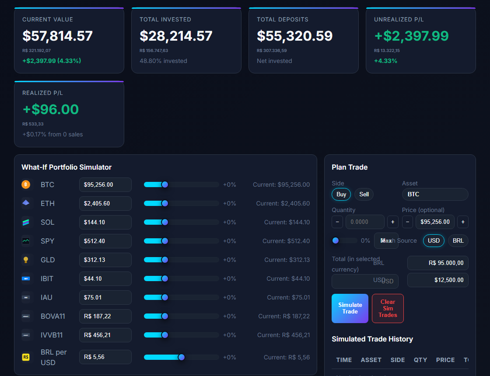
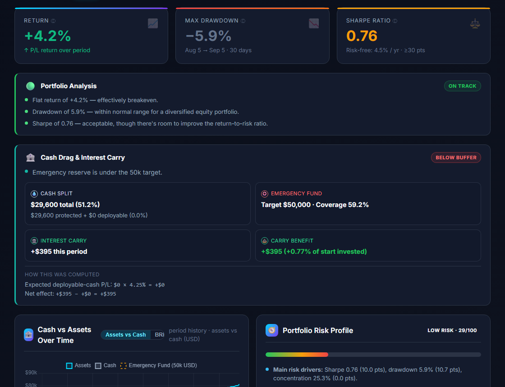
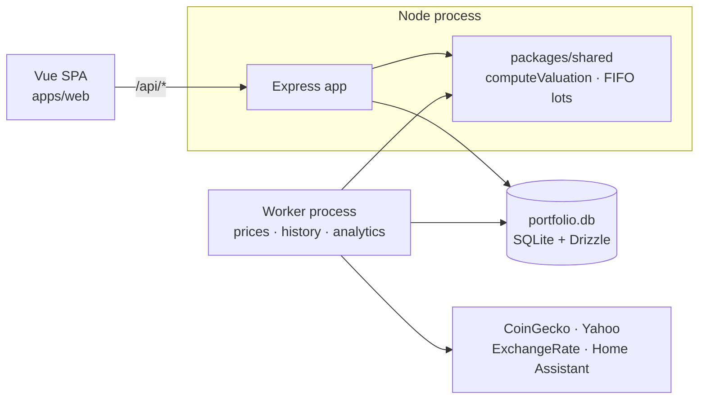

# Portfolio Dashboard

**A multi-currency portfolio tracker, built so the same number is never computed twice.**

Most portfolio trackers assume one currency and no basis. This one assumes
neither: every amount states the currency it is in, a BRL-denominated holding is
converted in exactly one place, and a sale has to walk real FIFO lots to know
what it actually realized. The rule that shapes the codebase is simple to state
and expensive to violate — _compute a number once, in `packages/shared`, and have
the dashboard, the API and the analytics all read it from there._

It began as a working single-file app and was rebuilt into an npm-workspaces
monorepo without ever being broken in between, which is a migration strategy
worth looking at even if the app itself is not your use case.


_The demo is the real application, screenshotted by `npm run demo:build` driving
the built bundle against the committed fixture. Nothing in it is drawn by hand._

---

## What actually happens to a trade

A buy is not a row. It opens a lot, and that lot is what a later sale has to
consume:



The walk lives in `replayFIFOLots` in `packages/shared/src/domain/portfolio.ts`,
and it is time-ordered — `ORDER BY time ASC`, never rowid, because on this
database the two disagree and a FIFO walk over unsorted input produces a
plausible wrong number rather than an error.

That matters more than it looks, because the same walk has to produce the same
answer in three places. The dashboard renders it, the server recomputes the
portfolio value from it every 30 minutes for a history snapshot, and the
simulator replays hypothetical trades through it. One implementation, so a
scenario cannot disagree with history.

### A trade and its cash cannot come apart

The second thing that is structural rather than conventional: buying moves cash,
and the app refuses to let those two facts drift.



The cash entry is written before the trade row so the link lands in the same
insert, and the delete reverses both or neither. Before that column existed,
deleting a trade left its proceeds in the balance permanently — cash, _invested_
and _total_ each inflated by the sale amount, never coming back down. It is the
kind of bug that reads as a rounding error for months.

---

## The application

| Dashboard                                                                                                                                                             | Allocation                                                                                                                                |
| --------------------------------------------------------------------------------------------------------------------------------------------------------------------- | ----------------------------------------------------------------------------------------------------------------------------------------- |
|                                                                                                                                |                                                                                      |
| Current value, invested cost, deposits, and realized and unrealized P/L — each with its BRL equivalent underneath, because a BRL book cannot be read in one currency. | The split the server computes. Flipping to _Investments_ re-asks the API for the other valuation; the browser never does this arithmetic. |

| Simulator                                                                                                                          | Analytics                                                                                                                                                     |
| ---------------------------------------------------------------------------------------------------------------------------------- | ------------------------------------------------------------------------------------------------------------------------------------------------------------- |
|                                                                                             |                                                                                                                        |
| "What if I had sold last year?" Sliders reprice hypothetical positions and replay them through the same lot logic the server uses. | Return, max drawdown, Sharpe and risk profile per period, plus the cash-drag analysis — the part that answers whether the portfolio is actually beating cash. |

The currency handling is the thread through all four. A holding denominated in
reais is stored in dollars, quoted in reais, and its _return_ depends on the FX
rate at purchase rather than at sale — so a naive tracker will quietly show a
gain that was entirely currency movement. Here the conversion is a named
function with one implementation, and a bond is excluded from it because a bond
is stored in USD and must not be converted.

---

## Architecture



Three decisions shape everything else.

**The domain logic is a package, not a folder.** `packages/shared` holds the
money helpers, the FIFO walk and `computeValuation`, and it is imported by the
API, by the web app and by the simulator alike. The money was duplicated in
three files before this existed, and the dashboard spent a whole phase deleting a
second copy of valuation rules it had written the phase before.

**The browser does not do arithmetic.** The dashboard reads
`GET /api/portfolio/valuation` and renders it. A chart that disagreed with the
number above it is the single most common way a dashboard like this rots, and
the cheapest fix is to make it structurally impossible.

**One database, two processes.** The web process serves HTTP; the worker runs
scheduled jobs. They share the file and the domain code, so a snapshot written at
3pm and a dashboard rendered at 3:01pm come from the same implementation. The
worker is a separate entry point precisely so it can be left switched off during
development.

---

## What is built today

- **427 tests across 22 suites**, plus 6 Playwright browser tests that drive the
  built bundle against a temporary database.
- **14 API route modules** behind an OpenAPI contract, with a generated typed
  client and a test that fails the build when a route is undocumented.
- **10 SQLite tables**, migrated automatically on boot by Drizzle.
- **3 Vue pages**, 33 components, and a Pinia store per page.
- **A five-job CI matrix** — lint, build, unit, e2e, and a Docker image that is
  _smoked_ rather than merely compiled — with 0 dependency vulnerabilities.
- **A real backup path.** Export and import cover every table that cannot be
  re-derived, and import is a true replace rather than a merge.

---

## Run it

```bash
npm install
npm run seed:local        # optional: import the synthetic fixture
npm run dev               # http://localhost:3000
```

There is no database server to provision and no service to configure — the
database is a file, and migrations run on first start.

Full instructions, including hot reload, Docker, the API, backup and restore,
and how to regenerate the demo media, are in
**[Getting Started](docs/GETTING-STARTED.md)**.

---

## How it got here

This was a migration of a working application, not a rewrite, and the plan is
[MODERNIZATION-PLAN.md](docs/MODERNIZATION-PLAN.md).

| Phase | Focus                                                         |      |
| ----- | ------------------------------------------------------------- | ---- |
| 0     | Safety net — no code changes                                  | done |
| 1     | Monorepo skeleton and hygiene                                 | done |
| 1.5   | Remove the vocabulary module                                  | done |
| 1.6   | Extract Finance into its own private app                      | done |
| 2     | `packages/shared` — contracts and pure domain logic           | done |
| 3     | Backend consolidation; close the SQL Explorer by default      | done |
| 4     | Strangler seam — scaffold `apps/web`                          | done |
| 5     | Migrate page by page, never breaking the app                  | done |
| 6     | Push valuation logic out of the browser                       | done |
| 7     | Quality gates — lint, contract test, CI matrix                | done |
| 8     | Showcase polish — demo media, synthetic fixtures, secret scan | done |

---

## What I'd do differently

The seams show, and in rough order of what they cost:

- **The strangler pattern was right and I would do it again**, but the redirect
  map in `app.ts` and the `LegacyHandoff` card existed for two phases and are now
  nearly dead code. For four pages a rewrite would have been faster overall; the
  pattern earns its keep when the legacy surface is bigger than this one was.
- **The test suite arrived too late.** For phase after phase, "does it still
  work?" meant opening the page and reading the numbers. The suite immediately
  found a live bug — `request()` swallowed network failures — that several
  careful manual passes had missed. The Pinia store tests should have been
  written alongside the first component, not after the last one.
- **Two database defects sat in the import endpoint for the whole life of the
  app.** It wrote a column dropped years earlier, so every restore failed; and
  `interest` had no unique key, so restoring a backup _doubled_ every interest
  month. Neither was a design error. They were code nobody ran, and both fixes
  were two lines, found only by testing the restore path against itself.
- **SQLite is both the right call and the ceiling.** One file, one writer is
  exactly right for one person's portfolio and it removes an entire class of
  operational work. It also means the snapshot job cannot overlap a heavy export
  and the write path is serialised. If this ever served more than one user,
  Postgres is the first change — the Drizzle schema carries over unchanged, which
  is the main reason to use an ORM here.
- **Alerting by webhook was under-designed.** The engine evaluates thresholds
  and posts to Home Assistant, but nothing records _why_ an alert fired beyond
  the previous price. A small `alert_events` table would make the history of the
  portfolio much easier to explain.

---

## Documentation

The repository separates **what this is**, **how it is built**, and **how each
decision was reached**.

- **[Getting Started](docs/GETTING-STARTED.md)** — run, build, test, deploy
- [AGENTS.md](AGENTS.md) — conventions and the pitfalls list; read before changing anything
- [Architecture overview](docs/ARCHITECTURE-OVERVIEW.md) — schema, caching, processes, scaling path
- [Backend](docs/BACKEND.md) — every route and the reasoning behind the data model
- [Modernization plan](docs/MODERNIZATION-PLAN.md) — the phases, the decisions, and the reasoning
- [Server setup](docs/SERVER-SETUP.md) — Ubuntu, Docker and Dokploy deployment
- [Home Assistant](docs/HOME_ASSISTANT_SETUP.md) — alert notifications
- [e2e tests](e2e/README.md) — how to run them, and what not to assert
- [Scripts](scripts/README.md) — benchmarks and the k6 load test

---

## A note on the data

Everything in `fixtures/` is synthetic: 14 invented trades, invented cash
balances, invented snapshots. The real portfolio data that lived in this
repository was removed from **every commit** before it was made public, and
`npm run scan:secrets` checks that on every run — the database, the old backup
directory, the exported JSON, and any credential-shaped string in a tracked file.
If that script ever fails, the answer is not to delete the file. It is to rewrite
the history, because the secret is already in the clone.

---

## License

MIT — see [LICENSE](LICENSE).
