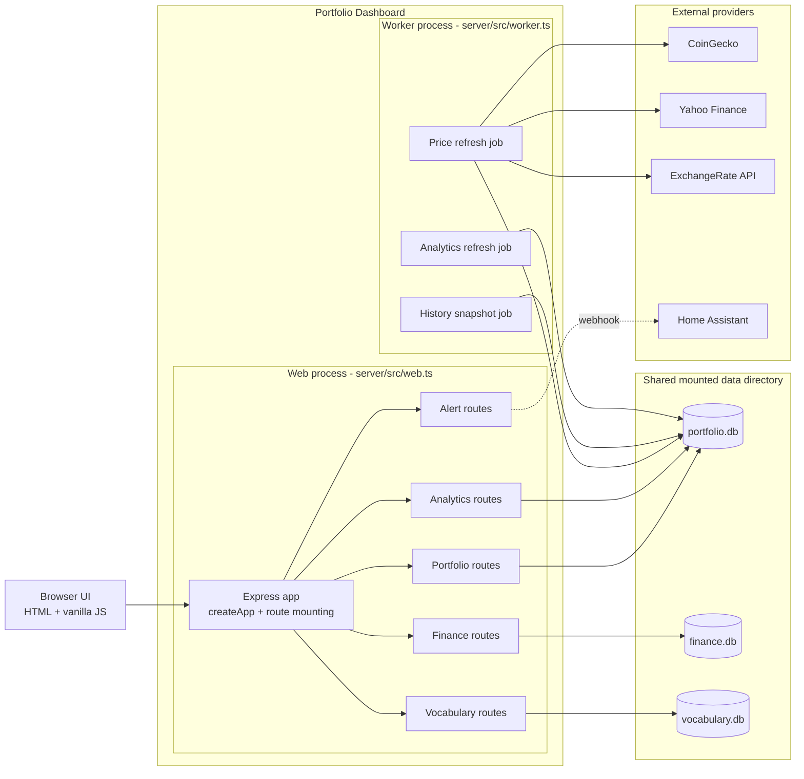
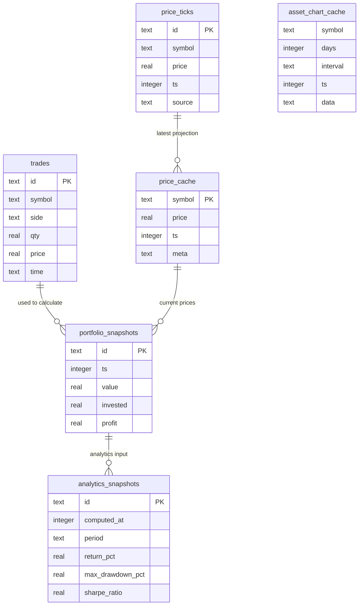
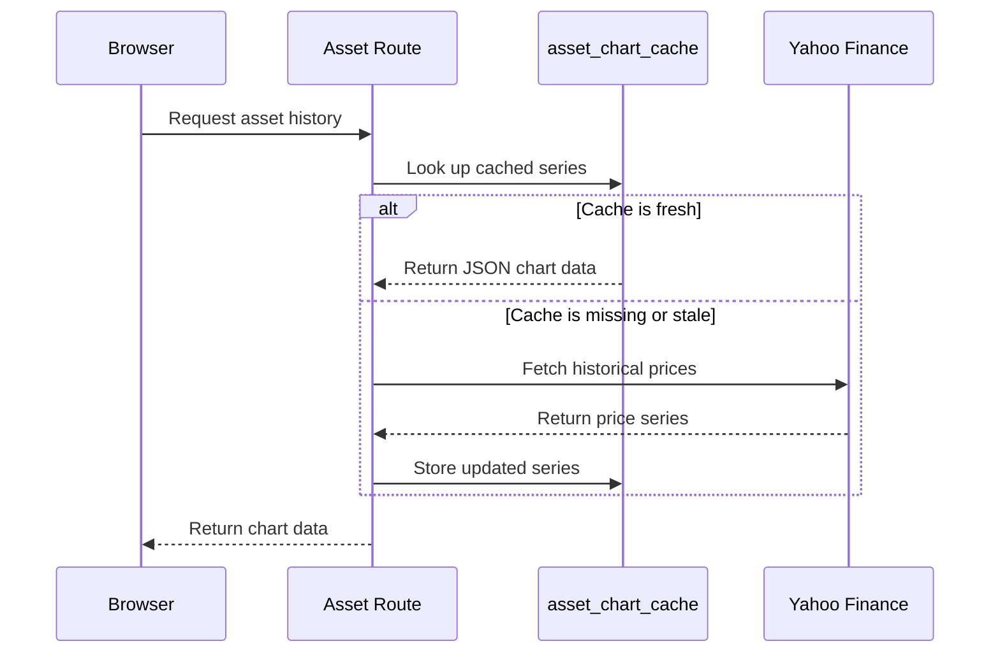

Yes. The dashboard has caching, multiple internal modules, and three separate SQLite databases. It is currently a **modular monolith with separate web and worker processes**, not a microservices architecture.

**High-level architecture**



The web process creates the Express app in [server/src/app.ts](server/src/app.ts), then starts from [server/src/web.ts](server/src/web.ts). Scheduled work starts independently from [server/src/worker.ts](server/src/worker.ts) and is organized under `server/src/jobs/`. `server/src/index.ts` remains a compatibility dispatcher for local `APP_ROLE` usage.

The two processes share the same database files. This separates HTTP traffic from scheduled work, but it does not yet provide independent storage scaling: SQLite still serializes writes and both processes depend on the same mounted data volume.

## Database schema



The complete portfolio schema is in [server/src/schema.ts](server/src/schema.ts).

## What is cached?

### 1. `price_cache`

Stores the latest price for each asset:

```text
BTC  ->  price, timestamp
SPY  ->  price, timestamp
GLD  ->  price, timestamp
```

It is a persistent, database-backed cache. The system reads it quickly instead of calling external market APIs for every dashboard request.

The price fetcher refreshes prices approximately every **8 minutes**. Stock and currency prices use the 8-minute freshness interval. Crypto prices are fetched during each scheduled refresh.

### 2. `asset_chart_cache`

Stores complete chart data as JSON:

```text
(symbol, days, interval) -> { labels: [...], prices: [...] }
```

Its TTL is:

- Hourly charts: 15 minutes
- Daily charts: 60 minutes

This is effectively a cache-aside flow:



### 3. In-memory HTTP response caches

The web process also caches the assembled JSON responses for expensive read
endpoints using the open-source `lru-cache` package:

| Endpoint | TTL | Purpose |
|---|---:|---|
| `/api/state` | 10 seconds | Avoids repeating the SQLite reads needed for the compact dashboard state payload |
| `/api/analytics` | 30 seconds | Avoids recalculating analytics inputs and derived fields for every request |

These caches are lazy: an expired entry is regenerated only when the endpoint
is requested. Concurrent requests for the same missing entry share one in-flight
calculation, so a burst does not trigger duplicate database work. Successful
`POST`, `PUT`, `PATCH`, and `DELETE` requests invalidate the response caches to
avoid serving known-stale state after a mutation.

The cache is process-local and bounded by an LRU limit. It is appropriate for
the current single web process, but separate web replicas would have separate
cache contents. When the web tier is scaled horizontally, the cache adapter can
be replaced with Redis without changing the route contracts.

OpenTelemetry exports application metrics, including cache hit and miss
counters, to the shared SigNoz collector for querying and alerting.

### 4. What is not a cache?

Some tables are derived read models, but they are better described as materialized views or projections:

- `portfolio_snapshots`: precomputed portfolio value over time
- `analytics_snapshots`: precomputed return, drawdown, Sharpe ratio, and allocation data

`price_ticks` is an append-only historical event log. It preserves every observed price rather than only the latest one.

## Are there different services?

There are **service modules**, but not independently deployed services.

| Module | Responsibility |
|---|---|
| `priceFetcher` | Fetches prices, updates caches, records price ticks |
| `historyManager` | Periodically creates portfolio history snapshots |
| `portfolioCalculator` | Pure portfolio and FIFO calculations |
| `analyticsService` | Computes return, drawdown, Sharpe ratio, allocation |
| `financeService` | Finance database operations |
| `vocabularyService` | Vocabulary database operations |
| `homeAssistantService` | Sends alert notifications |
| Route modules | HTTP API endpoints |

The route and domain modules run in the web process, while scheduled price, history, and analytics work runs in the worker process. They are still part of one deployable application and share the same database files, so a database or mounted-volume failure affects both roles.

In system-design terminology, the current design is approximately:

```text
One deployable application
├── Web process: routes and domain modules
├── Worker process: background schedulers
└── Three shared SQLite databases
```

The external systems are actual separate services:

- CoinGecko
- Yahoo Finance
- ExchangeRate API
- Home Assistant

The most important design lesson is that the application separates **event data**, **cached current state**, and **precomputed read models**:

```text
Trades / price_ticks / cash ledger
        ↓
Derived state and caches
        ↓
Fast dashboard and analytics reads
```

That is a solid foundation for discussing event logs, materialized views, cache freshness, and bounded domains from a system-design perspective.

## Scalability learning path

This project follows the design sequence from *System Design Interview: An Insider's Guide* by Alex Xu. Each step should produce a measurable result before introducing the next component.

### 1. Clarify requirements

Document the target workload before changing the architecture:

- Expected users and concurrent dashboard sessions
- Read/write ratio for portfolio, finance, and vocabulary APIs
- Price freshness requirement
- Acceptable analytics delay
- Availability and recovery targets

The current system favors freshness and simplicity over horizontal scalability. Scheduled price updates run every 8 minutes, analytics every 24 hours, and history snapshots every 30 minutes.

### 2. Estimate capacity

Record a baseline for:

- Requests per second and p95 latency for `/api/health`, `/api/prices`, `/api/state`, and `/api/analytics`
- Price ticks written per refresh and expected `price_ticks` growth
- Worker job duration and database write volume
- Cache hit rate for `price_cache` and `asset_chart_cache`

These measurements identify the real bottleneck instead of assuming that every component needs to scale.

### 3. Make the web tier stateless

The next deployment exercise is to run multiple web replicas behind a reverse proxy. The web process should not depend on in-memory user state. Browser `localStorage` remains client-local, while shared server state stays in the database or a future distributed cache.

### 4. Add asynchronous jobs

The worker currently relies on in-process `setInterval` calls. A durable job table or queue should represent:

```text
pending -> running -> completed
                  \-> failed -> retrying
```

This exercise introduces retries, idempotency, duplicate delivery, and worker crash recovery. Redis/BullMQ can replace the learning queue later, but it should not be the first step.

### 5. Introduce a shared cache

An in-process cache is sufficient for a single web process, but multiple replicas need a shared cache such as Redis. Candidate responses are `/api/prices`, `/api/analytics`, and the latest portfolio state. Define TTLs and stale-data behavior explicitly before adding the cache.

### 6. Move shared production data to PostgreSQL

SQLite is appropriate for local development and a single-node deployment. PostgreSQL becomes the next storage exercise when concurrent web replicas and workers create write contention. Migrate the portfolio database first, add indexes from query measurements, and keep finance and vocabulary migrations separate so each boundary can be evaluated independently.

### Current bottlenecks

| Area | Current design | Scalability consequence |
|---|---|---|
| Web | Multiple replicas are possible, but no proxy is configured | Routing and health-based failover are still manual |
| Worker | One process with in-process timers | Jobs are lost or duplicated across restarts |
| Storage | Shared SQLite files | Writes are serialized and storage is node-bound |
| Cache | Database and browser caches | No shared cache across web replicas |
| Observability | OpenTelemetry metrics exported to SigNoz, logs, and health endpoint | No SLOs or alert rules for latency, queue depth, or cache behavior yet |

The most valuable next experiment is capacity measurement followed by a durable job queue. It makes the later decisions about Redis, PostgreSQL, and replicas evidence-based.
