# DDIA Case Study — Portfolio Dashboard

*A field analysis of how this personal finance system implements foundational concepts from Designing Data-Intensive Applications.*

---

## What This Document Is

This is a unified case study drawing from three source documents — `DDIA-patterns.md`, `DDIA-experiments.md`, and `DDIA-chapter-analysis.md` — cross-referenced against the live codebase. It answers one central question: **how well does this system practice what the book preaches?**

The evaluation is honest. Where the implementation is strong, it is celebrated with an explanation of why the design choice is superior. Where it falls short, the gap is named and the consequence is explained. No patterns are claimed that do not exist in the running code.

---

## Part 1 — The Three Databases and Every Table

The system separates all persistent data into three physically independent SQLite files. This is a deliberate architectural decision, not an accident. Each database maps to a domain that has its own lifecycle, its own failure surface, and its own evolution cadence.

### Database Map

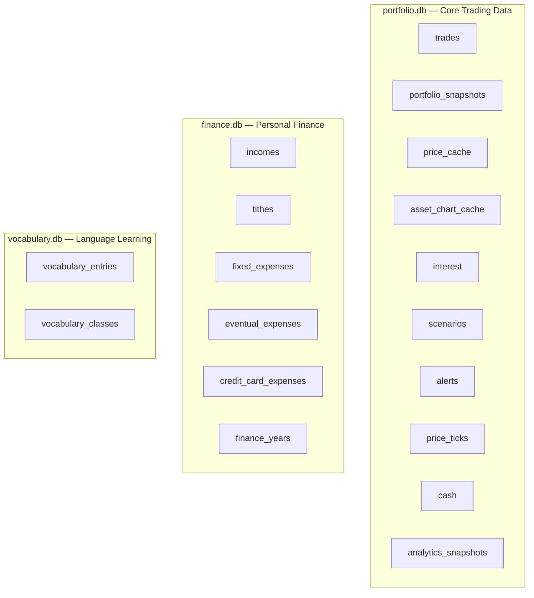

---

### portfolio.db — All Tables

| Table | Role | Pattern |
|---|---|---|
| `trades` | Immutable event log of every buy and sell | Append-only event log |
| `portfolio_snapshots` | Pre-computed portfolio value over time | Materialized view |
| `price_cache` | Current market price per symbol | Write-through cache |
| `asset_chart_cache` | Multi-day price series per symbol (JSON blob) | Write-through cache |
| `interest` | Monthly interest accruals, per currency | Reference data |
| `scenarios` | Named simulation snapshots with flexible JSON state | Document store (embedded) |
| `alerts` | Price alert rules with their last trigger state | Mutable operational state |
| `price_ticks` | Every price observation ever recorded, never overwritten | Append-only event log |
| `cash` | Append-only ledger of deposits/withdrawals; `SUM(amount WHERE ts ≤ t)` derives cash state at any past timestamp | Append-only ledger |
| `analytics_snapshots` | Pre-computed analytics per time period | Derived batch aggregate |

### finance.db — All Tables

| Table | Role | Pattern |
|---|---|---|
| `incomes` | Monthly income entries per year | Partitioned by `year` |
| `tithes` | Tithe entries with per-source breakdown (JSON) | Partitioned by `year` |
| `fixed_expenses` | Recurring monthly costs | Partitioned by `year` |
| `eventual_expenses` | One-off or occasional expenses | Partitioned by `year` |
| `credit_card_expenses` | Expenses per credit card per month | Partitioned by `year` and `card` |
| `finance_years` | Year registry; controls which years exist | Year dimension table |

### vocabulary.db — All Tables

| Table | Role | Pattern |
|---|---|---|
| `vocabulary_entries` | Individual word/phrase learning records | Mutable entity store |
| `vocabulary_classes` | Groupings of phrases from an upload session | Parent entity |

---

## Part 2 — How the Tables Relate

### portfolio.db Relationships

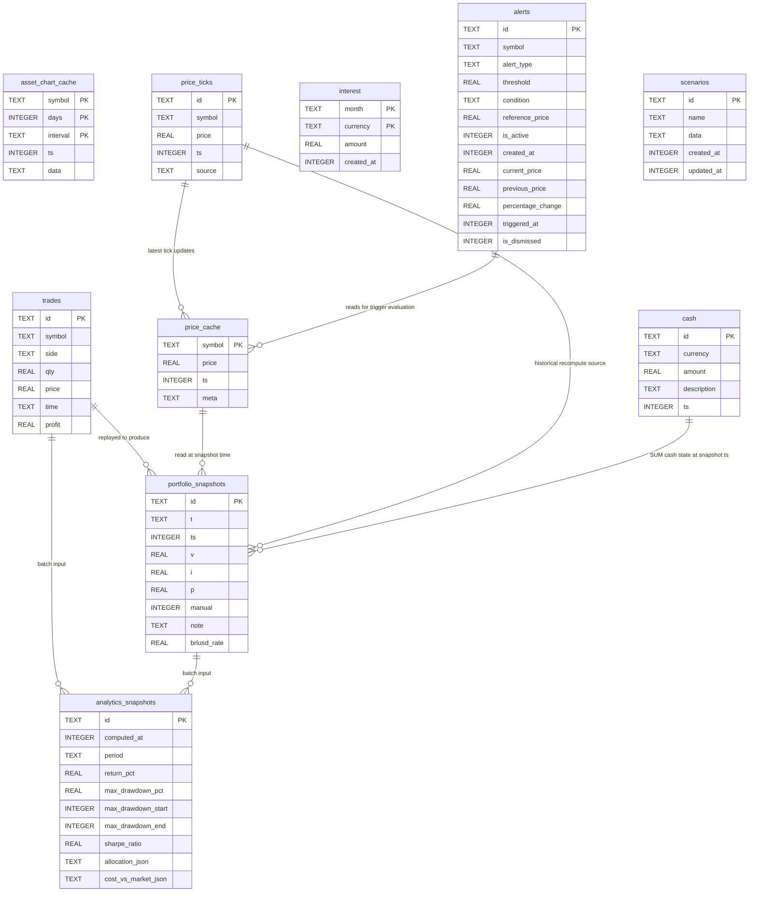

### finance.db Relationships

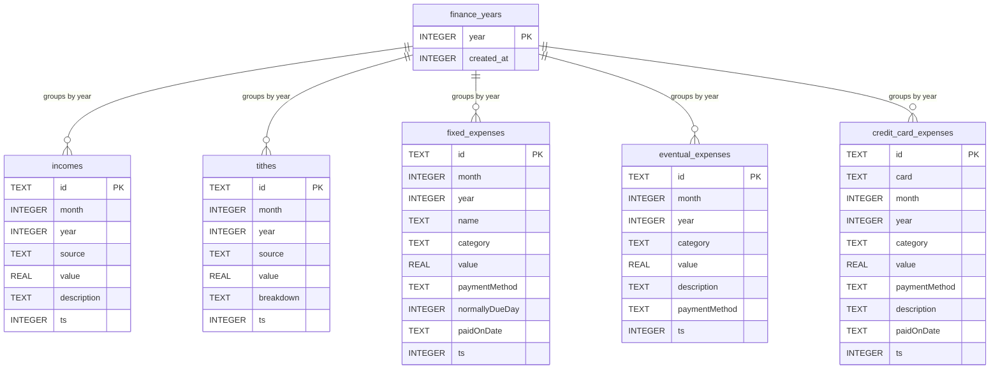

### vocabulary.db Relationships

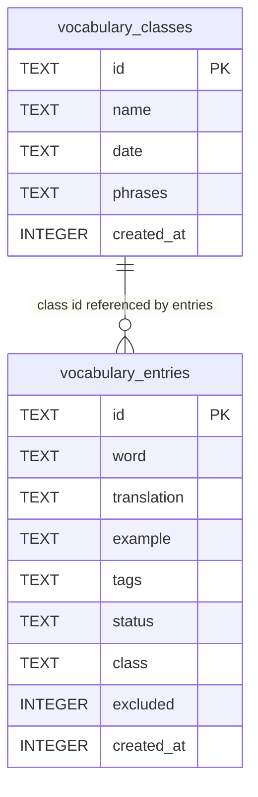

---

## Part 3 — The Derived Data Hierarchy

One of the book's most powerful ideas is that **data has a provenance hierarchy**: some tables are sources of truth that cannot be reconstructed from anything else, and other tables are derived views that can be deleted and rebuilt without any information loss.

This system has a clean, explicit hierarchy:

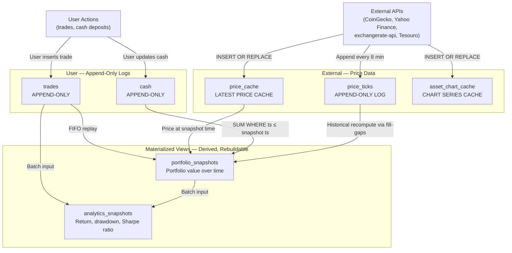

**Why this matters:** If the `portfolio_snapshots` table were accidentally dropped, the system could rebuild it entirely by running `POST /api/history/fill-gaps`. No historical portfolio value would be permanently lost. The same is true for `analytics_snapshots` — delete all rows, call the batch refresh endpoint, and the data reappears. This is the hallmark of a correctly designed derived-data system.

---

## Part 4 — The Six DDIA Patterns This System Gets Right

### Pattern 1 — Append-Only Event Log

**The book's claim:** The right way to model facts that happened is to record them as immutable events in a log. The current state of anything is derived by replaying the log forward. The log is the source of truth; the current state is a cache of the log's latest projection.

**What this system does:** The `trades` table is a textbook implementation of this pattern. There is no update path in the entire codebase — the only write operations on `trades` are insert and delete. Every trade carries a `time` field that records when the trade happened in the real world, separate from when it was entered into the system. This distinction between event time and processing time is exactly what the book calls out as critical for correctness.

The `price_ticks` table extends this pattern to prices: every price the system has ever seen is preserved forever and never overwritten. The `cash` table does the same for cash: every deposit and withdrawal is an immutable row, and the cash balance at any past timestamp is derived by `SUM(amount) WHERE ts <= ?`. There is no separate cash-snapshot table — the ledger itself is the source of truth.

**Why it is better:** Without an immutable log, answering the question "what was my portfolio worth on March 3rd at 2pm?" would be impossible. With the event logs in place, the answer is always available via `POST /api/history/fill-gaps` — the system replays the trade log, looks up the nearest price tick for each symbol before that timestamp, and reconstructs the exact portfolio state. This is temporal querying, and it is only possible because the underlying data was never mutated.

**What it enables:** The `recomputeHistoryAt(ts)` function in `historyManager.ts`. The analytics batch job. Any future audit trail feature. The entire correctness story of the history chart rests on `trades` being append-only.

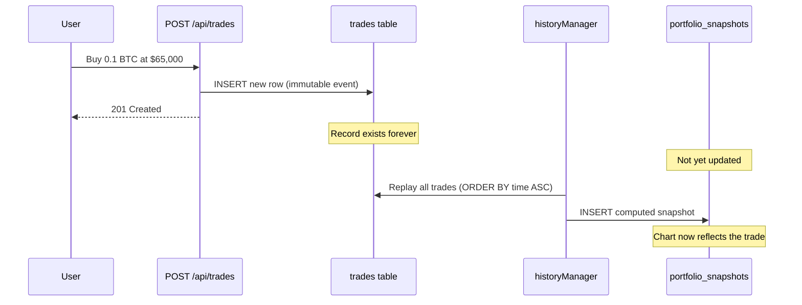

---

### Pattern 2 — Materialized View

**The book's claim:** Pre-computing a read-optimized result from source data, and storing it, is the right trade-off when the read pattern is predictable and the computation is expensive. The materialized view can always be rebuilt from the source. It holds no independent truth.

**What this system does:** `portfolio_snapshots` is a periodic materialized view. Every 30 minutes, the system reads all trades, all current prices, and the latest cash state, runs the FIFO lot calculation, converts currencies, and writes a single summary row. The frontend's history chart renders directly from `portfolio_snapshots` without ever touching `trades` or running any calculations.

The view also stores `brlusd_rate` — the BRL/USD exchange rate that was used at computation time. This is a deliberate denormalization that captures a historical fact that would otherwise be lost. The book calls this making implicit dependencies explicit.

**Why it is better:** Without the materialized view, every request to render the history chart would need to replay potentially thousands of trades, fetch prices for each symbol at each point in time, and run the currency conversion. That would be a multi-second operation per page load. With the materialized view, rendering the chart is a single indexed table scan returning a few thousand rows.

**What it enables:** Sub-millisecond chart loads. Historical chart accuracy even during API outages. The ability to delete and regenerate the chart data at any time. The foundation for the analytics batch job, which reads `portfolio_snapshots` as its input.

```mermaid
flowchart LR
    subgraph "Sources — Immutable or Slowly Changing"
        T[trades]
        PC[price_cache]
        CE[cash\nAppend-only ledger]
    end

    subgraph "Computation"
        RC["replayFIFOLots()\npure function"]
        CPV["computePortfolioValue()\npure function"]
    end

    subgraph "Derived Output"
        PS[portfolio_snapshots\none row every 30 min]
    end

    subgraph "Frontend Consumer"
        CH["History Chart\nGET /api/history"]
    end

    T -->|All trades in order| RC
    RC -->|FIFO positions| CPV
    PC -->|Current prices| CPV
    CE -->|SUM(amount) WHERE ts ≤ ts| CPV
    CPV -->|v, i, p, brlusd_rate| PS
    PS -->|Pre-aggregated rows| CH
```

---

### Pattern 3 — Write-Through Cache with TTL

**The book's claim:** Caches trade freshness for latency. A write-through cache is updated on every write to the source, keeping reads fast while the source stays authoritative. TTL-based expiry is a simple, stateless freshness mechanism.

**What this system does:** `price_cache` is a write-through cache over external price APIs. Every time a price is fetched, the row is upserted atomically — the previous price disappears and the new price takes its place. The cache never grows beyond one row per symbol. The TTL lives in the application layer: if a cached price is less than 8 minutes old, the system skips the API call entirely.

`asset_chart_cache` uses the same pattern at a larger granularity: one row per (symbol, day-range, interval), storing an entire price series as a JSON blob. The TTL varies by interval — 15 minutes for hourly charts, 60 minutes for daily charts.

**Why it is better:** Without the cache, every chart render or portfolio snapshot would require an HTTP call to CoinGecko or Yahoo Finance. Those APIs have rate limits, latency variance, and can be unavailable. With the cache, the system degrades gracefully: if CoinGecko is down, the dashboard still shows prices that are at most 8 minutes stale rather than failing entirely.

**What it enables:** The system can serve portfolio values to the frontend even while the price fetcher is mid-cycle. The `price_ticks` log complements the cache — the cache serves the current price in a single row read; the ticks log provides the historical record for recomputation.

---

### Pattern 4 — CQRS (Command Query Responsibility Segregation)

**The book's claim:** Writes and reads are fundamentally different operations with different performance characteristics and consistency requirements. Separating them into distinct models — one optimized for consistency, one optimized for query access patterns — is a powerful architectural pattern. The read model is kept in sync with the write model asynchronously.

**What this system does:** The write model is `trades`. Inserting a trade is a fast single-row append. The read model is `portfolio_snapshots`. Rendering the history chart is a fast indexed table scan. They share no tables. They are synchronized every 30 minutes by the history manager scheduler.

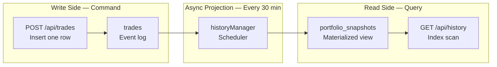

The frontend consumes both models simultaneously but for different purposes: `portfolio_snapshots` drives the value chart and the summary cards; `trades` drives the trade table display. This is a clean CQRS separation at the transport layer.

**Why it is better:** In a system without CQRS, the dashboard would have to aggregate all trades every time the chart needs to render. The aggregation query would grow more expensive as the trade history grows. With CQRS, the read side query time is constant regardless of how many trades exist, because the aggregation has already been done and stored.

**What it enables:** Near-instant chart loads regardless of portfolio size. The independence of the read and write models means each can be optimized separately. The materialized view can be deleted and rebuilt without affecting the trade history. A future analytics page can introduce a second read model (`analytics_snapshots`) without touching the write side at all.

---

### Pattern 5 — Pure Computation Layer

**The book's claim:** The most testable and reusable code is code that has no side effects — it reads its inputs from arguments, not from global state or the database, and returns its output as a return value, not by writing to storage. Separating stateful I/O from pure computation makes both easier to reason about.

**What this system does:** `portfolioCalculator.ts` exports two pure functions. `replayFIFOLots` takes a list of trades and returns a map of FIFO lot positions per symbol. `computePortfolioValue` takes positions, prices, and cash state and returns the portfolio's total value and cost basis. Neither function touches the database. Neither function has a side effect. Both are deterministic — the same inputs always produce the same output.

`historyManager.ts` becomes the I/O orchestrator: it fetches data from the database, passes it to the calculator functions, and writes the result back. The calculation logic itself is completely isolated.

**Why it is better:** Before this separation existed, the computation was embedded inside the database orchestration code. Testing required setting up a database, inserting records, and running the scheduler. Now, testing `replayFIFOLots` is as simple as calling it with a list of plain objects. The test suite for `portfolioCalculator.ts` is the most reliable code in the project precisely because it has zero infrastructure dependencies.

**What it enables:** The same `computePortfolioValue` function is used by both the live 30-minute scheduler and the historical `recomputeHistoryAt(ts)` function. The function doesn't know or care which context is calling it. This is the stream-processor pattern from the book: a stateless transform function between an input source and an output sink.

---

### Pattern 6 — Vertical Partitioning by Domain

**The book's claim:** Splitting data across multiple stores by domain boundaries (vertical partitioning) provides fault isolation, independent evolution, and enforces that cross-domain access happens through explicit interfaces rather than JOIN queries.

**What this system does:** Three separate SQLite files, each with its own connection, its own helper functions (`run/runF/runV`), and its own initialization lifecycle. Finance data cannot accidentally be queried alongside portfolio data. A schema migration in `finance.db` cannot corrupt `portfolio.db`. If the vocabulary database fails to initialize at startup, the server continues running with full portfolio and finance functionality.

**Why it is better:** In a single-database design, a schema migration that goes wrong can affect all tables simultaneously. A table scan that consumes all I/O capacity slows down every other query. A broken `CREATE TABLE` statement blocks server startup entirely. The three-database design contains all of these failure modes to one domain.

**What it enables:** The conditional route mounting pattern — `financeDb.init()` failing silently at startup does not prevent the portfolio dashboard from loading. Independent schema evolution for each domain. The convention-enforced boundary (`runF` is only for `finance.db`) prevents accidental cross-domain queries that would fail silently at runtime.

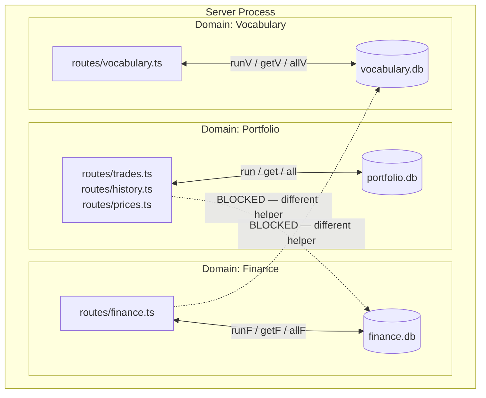

---

### Pattern 7 — Idempotent Backfill via Composite Unique Index

**The book's claim:** Idempotency — the property that running an operation multiple times produces the same result as running it once — is essential for any data pipeline that must be safe to restart or re-run. At the storage layer, a uniqueness constraint is the most reliable way to enforce it.

**What this system does:** The `price_ticks` table has a composite unique index on `(symbol, ts)`:

```sql
-- schema.ts
uniqueIndex('uq_price_ticks_symbol_ts').on(t.symbol, t.ts)
```

The price tick append function uses `INSERT OR IGNORE`:

```typescript
await run(
  'INSERT OR IGNORE INTO price_ticks (id, symbol, price, ts, source) VALUES (?, ?, ?, ?, ?)',
  [randomUUID(), symbol, price, ts, source]
);
```

The historical backfill script (`migrate:backfill-prices`) fetches two years of daily Yahoo Finance closes and attempts to insert each (symbol, day-close-ts) pair. Without the unique constraint, re-running the script would duplicate every row in the table. With it, the second run inserts nothing — all rows already exist and are silently skipped.

**Why it is better:** A backfill operation that can be safely re-run after a network failure, a partial crash, or a ticker config change is strictly superior to one that requires manual cleanup. The constraint makes correctness unconditional: the table cannot contain duplicate ticks regardless of how many times or from how many sources the same price observation arrives.

**What it enables:** The same `appendPriceTick` function is called by both the live 8-minute price refresh cycle and the historical backfill script. Neither caller needs to check whether the tick already exists — the database enforces the invariant. This is the "exactly-once" delivery guarantee at the storage layer, achieved without any application-level deduplication logic.

---

### Pattern 8 — Time-Bucketed Downsampling for Chart Queries

**The book's claim:** When a dataset is too large for direct rendering, downsampling it into time buckets before serving it to the client reduces network payload, rendering cost, and query latency — without materially changing the visual result. The downsampling function is a pure reduction over sorted time-series data.

**What this system does:** `GET /api/history` accepts a `range` parameter. For ranges shorter than "all", the route fetches only the rows within the range window, then reduces them through `bucketRows`:

```typescript
export const BUCKET_MS: Record<string, number> = {
  day:       30 * 60 * 1000,         // one point per 30 min  → up to   48 points
  week:       2 * 60 * 60 * 1000,    // one point per 2 hours → up to   84 points
  month:     24 * 60 * 60 * 1000,    // one point per day     → up to   30 points
  '6months': 24 * 60 * 60 * 1000,   // one point per day     → up to  180 points
  year:       7 * 24 * 60 * 60 * 1000, // one point per week → up to   52 points
};

export function bucketRows(rows: any[], bucketMs: number): any[] {
  const map = new Map<number, any>();
  for (const row of rows) {
    const bucket = Math.floor((row.ts as number) / bucketMs);
    map.set(bucket, row); // later rows overwrite earlier ones in the same bucket
  }
  return Array.from(map.values());
}
```

The function is deterministic, stateless, and has no database dependency. It takes a sorted array and returns a smaller sorted array — the last (most recent) row in each fixed-size time window.

**Why it is better:** `portfolio_snapshots` accumulates one row every 30 minutes. After a year, that is approximately 17,500 rows. Sending all 17,500 rows to the frontend for a "week" chart view that will display 84 data points is wasteful. `bucketRows` reduces the payload by roughly 200× for the year view. The chart looks identical; the response is orders of magnitude smaller.

**What it enables:** The frontend chart library receives the exact number of points it can visually represent, rather than a raw dump of all stored history. The bucket size is tuned per range to match the expected chart resolution — a "day" view gets 30-minute resolution; a "year" view gets weekly resolution. This is time-series data reduction at the serving layer, analogous to rollup tables in time-series databases.

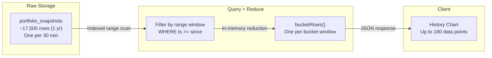

---

## Part 5 — The Batch Layer: Analytics Pipeline

The `analytics_snapshots` table is the most recent addition to the derived data hierarchy and the clearest expression of the batch processing pattern from Chapter 10.

### What Batch Processing Means Here

Batch processing takes a bounded, immutable dataset and runs a function over it to produce a derived output. The output is entirely recomputable from the input. The key insight: correctness over speed. The batch runs once per day; it doesn't need to be fast.

The analytics pipeline reads from two already-materialized tables — `trades` and `portfolio_snapshots` — and produces five pre-computed rows, one per time period (1W, 1M, 3M, 1Y, ALL). Each row contains:

- **Return percentage** for the period — simple `(end − start) / start`
- **Time-Weighted Return (TWR)** — cash-flow-adjusted return that isolates pure investment performance (see below)
- **Maximum drawdown** — the largest peak-to-trough decline, with its start and end timestamps
- **Sharpe ratio** — risk-adjusted return measured against a risk-free rate, using TWR-adjusted sub-period returns
- **Asset allocation** at period end, as a JSON map
- **Cost vs. market** per asset, as a JSON map

### Time-Weighted Return — Separating Investment Performance from Capital Flows

Simple return (`(end - start) / start`) conflates two unrelated phenomena: how well the assets performed, and when money was added or withdrawn. A portfolio that received a large deposit right before a market crash will show a terrible simple return, even if the asset selection was excellent. A portfolio that happened to receive no deposits during a bull run will show an outstanding return for the wrong reason.

TWR strips this effect by computing a chain of sub-period returns and adjusting each sub-period's ending value by the cash flows that arrived during that interval:

```
// For each consecutive snapshot pair [i-1, i]:
// Sum any cash deposits or withdrawals that fell in (prev.ts, curr.ts]
cfSum = sum of cashFlows where ts in (prev.ts, curr.ts]

// Sub-period factor: how much did the portfolio grow on its own?
factor_i = (curr.v − cfSum) / prev.v

// Chain all sub-period factors
TWR = (factor_1 × factor_2 × … × factor_n − 1) × 100
```

This is a pure computation: the function takes a list of `{ ts, v }` points and a list of `{ ts, amountUSD }` cash flow events, and returns a single number with no database access.

**Why it matters from a DDIA perspective:** TWR is a data transformation that decouples one signal (investment performance) from noise (timing of deposits). It is the same principle as the book's discussion of derived metrics — the raw data (portfolio value over time + cash flows) is the source of truth; TWR is a read-model projection that answers a specific query: "what return did the investment decisions produce, independent of how much money I happened to add?" The two inputs to the function both come from existing event logs, and the function is deterministic and side-effect free — a textbook example of the pure computation layer pattern.

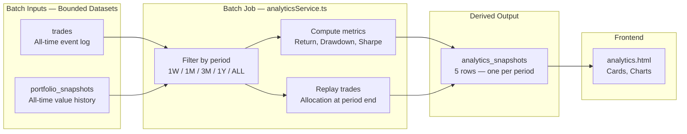

### Why Batch and Not Real-Time

The analytics metrics have a natural staleness tolerance. Nobody checks their Sharpe ratio every 8 minutes. Running the batch once per day means the computation only touches the database once per day, even though the frontend can read the results thousands of times. This is the ratio the book calls "read amplification vs. write amplification" — here, a single expensive write enables unlimited cheap reads.

Because `analytics_snapshots` is fully derived, deleting all five rows and triggering the batch job regenerates identical data. The batch view has no independent truth. This is the Lambda Architecture's batch layer: the raw data streams in, the batch job periodically computes aggregate views, and the serving layer reads the pre-computed results.

---

## Part 6 — The Lambda Architecture in Practice

The book describes the Lambda Architecture as three layers working together: a batch layer that recomputes everything from scratch periodically, a speed layer that processes recent events in real time, and a serving layer that merges both for reads.

This system accidentally implements a simplified Lambda without ever naming it as such:

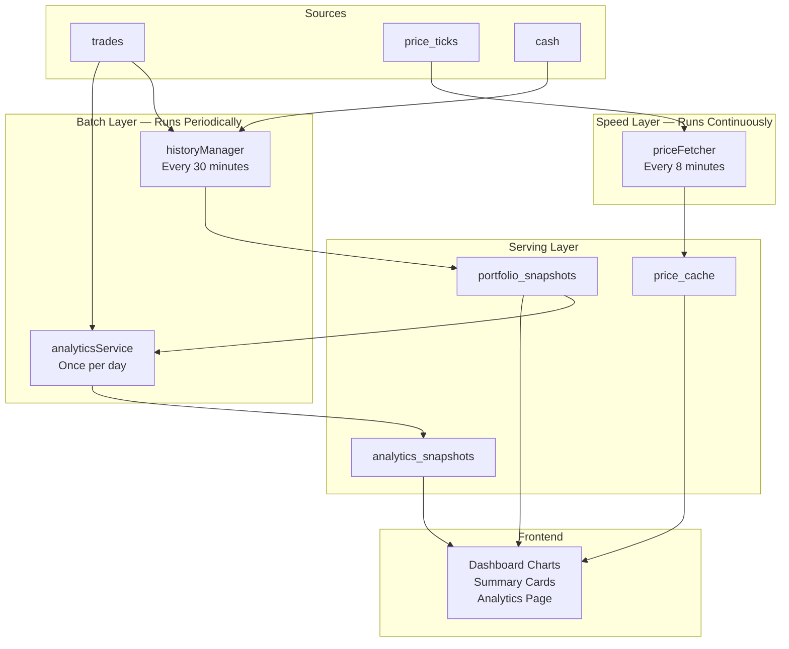

| Lambda Layer | This System's Implementation |
|---|---|
| Batch layer | `historyManager` (30-min) and `analyticsService` (daily) — recompute from all historical data |
| Speed layer | `priceFetcher` (8-min) — processes the most recent price observations in near real-time |
| Serving layer | `portfolio_snapshots`, `price_cache`, `analytics_snapshots` — pre-aggregated reads |

The book criticizes Lambda Architecture for requiring two separate codebases — one batch, one streaming — that must produce identical results. This system avoids that problem because the batch job and the scheduler are both written in TypeScript in the same process, using the same pure computation functions from `portfolioCalculator.ts`.

---

## Part 7 — How the System Handles Time Correctly

Time is one of the hardest problems in data systems. The book devotes significant attention to the distinction between **event time** (when something happened in the real world) and **processing time** (when the system recorded it). Conflating them is a source of subtle and persistent bugs.

This system handles time correctly in several ways:

### Dual Timestamps on Trades

Every trade carries a `time` field (ISO 8601 business timestamp — when the trade was executed in reality) that is entirely independent of when the row was inserted into the database. A trade that happened six months ago but was entered today carries `time` of six months ago. The FIFO lot replay uses `time`, not the insertion order, ensuring that historical reconstructions are always accurate regardless of when trades were entered.

### The `brlusd_rate` Column

`portfolio_snapshots` stores the BRL/USD exchange rate that was used when the snapshot was computed. Without this column, historical snapshots baked in a currency rate with no record of what it was. If the rate changed significantly between snapshots, it would appear as portfolio volatility that was actually currency volatility — but the two would be indistinguishable. Storing the rate makes the dependency explicit, which is what the book recommends.

### The `price_ticks` Log Enables Point-in-Time Recomputation

Because every price observation is stored in `price_ticks` with its timestamp, `recomputeHistoryAt(ts)` can reconstruct the portfolio value at any past moment using the prices that were actually known at that moment — not the prices known today. This is temporal consistency: the recomputed value for March 3rd at 2pm uses March 3rd 2pm prices, not current prices.

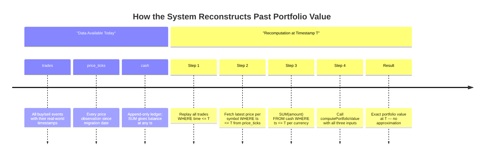

### Sharpe Ratio — Outlier Rejection via Median Interval

Computing a meaningful Sharpe ratio from 30-minute portfolio snapshots introduces a subtle time problem. Every time the server restarts, there is a gap in `portfolio_snapshots` — potentially several hours or a full day. Including that gap as a single "sub-period return" would make the return look either abnormally large or abnormally small, biasing the standard deviation calculation that underlies the Sharpe ratio.

The system detects and discards these outlier gaps:

```typescript
const median = medianInterval(points.map(p => p.ts));
const threshold = 2.5 * median;

for (let i = 1; i < points.length; i++) {
  const gap = points[i].ts - points[i - 1].ts;
  if (gap <= 0 || gap > threshold) continue; // skip restart gaps
  // ... include this sub-period in returns
}
```

`medianInterval` computes the median of all consecutive-pair gaps in the dataset. A normal 30-minute snapshot produces a median of ~1,800,000 ms. A gap that is more than 2.5× the median — say, a 5-hour server outage — is treated as infrastructure noise rather than investment signal and excluded from the return series. This is an application of the book's observation that in distributed systems, partial failures and latency spikes must be detected and handled explicitly, not allowed to silently corrupt derived metrics.

### Multi-Source Price Fallback (Hedged Reads)

The book discusses hedged reads as a technique for reducing the impact of slow or failing backend nodes by sending the same request to multiple sources and using the first response that arrives. This system applies a sequential variant: for Yahoo Finance price fetches, each symbol has an ordered list of `historicalFallbacks` (alternative ticker symbols) that are tried in order if the primary ticker fails or returns no data.

```typescript
const candidates = config?.historicalFallbacks || [symbol];
for (const yf of candidates) {
  try {
    // fetch from Yahoo Finance with yf ticker
    return latestClose;
  } catch (e) {
    if (e instanceof Error && /YF 404/.test(e.message)) continue;
    // try next candidate
  }
}
throw new Error('Invalid Yahoo response (all candidates failed)');
```

This is sequential hedging rather than parallel — the system tries each candidate in order and moves to the next on failure. The trade-off is predictable: lower concurrency against external APIs (respecting rate limits), at the cost of slightly longer fetch time when the primary ticker fails. Each failure is contained to the retry loop; a missing ticker for one asset never blocks the price refresh for others.

---

## Part 8 — The Trade-offs Made Consciously

The book's central argument is not "always use the most sophisticated pattern." It is "understand the trade-off you are making." Every decision in this system that deviates from a book ideal is a conscious trade-off, not an oversight.

### Decision Table

| Decision | What Was Gained | What Was Sacrificed | DDIA Chapter |
|---|---|---|---|
| Single process, no message bus | Zero infrastructure overhead | Event-driven sync; CDC must be simulated | Ch. 11 |
| Trades can be deleted | Convenient correction UX | Strict immutability; compensation events | Ch. 11 |
| 30-minute snapshot interval | Low database write pressure | Up to 30-min lag between trade insert and chart update | Ch. 12 |
| JSON blobs in `asset_chart_cache` | Single-row fetch for full chart series | Cannot query inside the blob; no column-level aggregation | Ch. 3 |
| No API versioning | Simpler development | Silent breaking changes on field renames | Ch. 4 |
| Sequential price refresh | Respects rate limits naturally | Refresh cycle grows linearly with symbol count | Ch. 8 |
| Three separate databases | Domain isolation, independent failure | No cross-domain JOIN or atomic transactions | Ch. 6 |
| Drizzle ORM (query builder + migrations) | Type-safe schema DSL; versioned `.sql` migration files; no native build dependencies | Most route queries still use raw SQL helpers; schema compilation step added to workflow | Ch. 2, 4 |
| `INSERT OR REPLACE` as upsert | Idempotent cache updates | Previous cache row is silently discarded | Ch. 3 |
| Serve stale prices on API failure | High availability; dashboard always loads | Eventual consistency with market reality | Ch. 9 |
| better-sqlite3 synchronous driver wrapped in `Promise.resolve().then()` | Single-writer guarantee; no SQLITE_BUSY errors; no async concurrency bugs | No true async I/O; long-running reads block the event loop momentarily | Ch. 3, 8 |
| TWR over simple return as the primary performance metric | Isolates investment performance from deposit/withdrawal timing | Requires the cash event log to be complete and correctly timestamped | Ch. 10 |
| Sequential fallback tickers (hedged reads) for Yahoo Finance | Fetch succeeds even when primary ticker is delisted or renamed | Adds latency for each failed candidate before the fallback succeeds | Ch. 8 |
| AbortController 10-second timeout on all external fetches | Prevents hung connections from blocking the price refresh indefinitely | Aggressive timeout may trigger false aborts on slow but valid responses | Ch. 8 |
| In-memory `bucketRows` downsampling at the route layer | No pre-aggregated rollup tables needed; chart queries are always fast | Downsampling CPU work done per request rather than once at write time | Ch. 10 |

---

## Part 9 — The Replayability Guarantee

The single most important design property this system has achieved is **replayability**: the ability to delete every derived table and rebuild it from the immutable logs without losing any information.

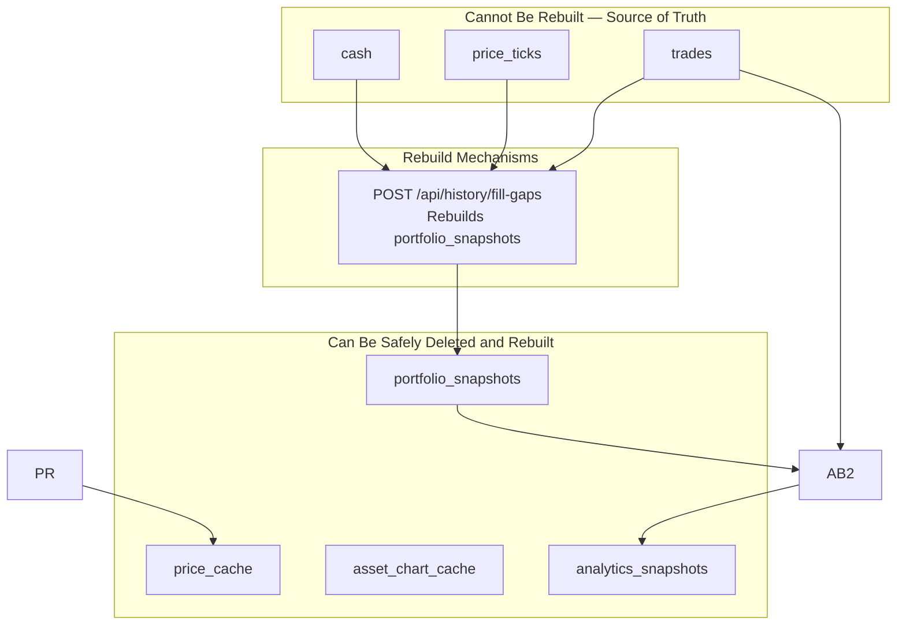

This property means that upgrading the FIFO calculation logic, correcting a currency conversion bug, or backfilling a newly added column to the snapshots table are all equivalent operations: delete the derived rows, apply the fix to the computation code, and run the rebuild endpoint. The immutable logs guarantee that the rebuilt data will be correct.

The book calls this the most valuable property of event-sourced systems: **the ability to reprocess the past with new logic.**

---

## Summary — Implementation Scorecard

| DDIA Pattern | Chapter | Status | Quality |
|---|---|---|---|
| Append-only event log (`trades`) | Ch. 11 | Implemented | Strong — no update path; event time vs. processing time correctly separated |
| Append-only price event log (`price_ticks`) | Ch. 11 | Implemented | Strong — immutable; indexed; enables point-in-time recomputation |
| Append-only cash ledger (`cash`) | Ch. 11 | Implemented | Strong — `SUM(amount WHERE ts ≤ ?)` derives cash state at any past timestamp; no separate snapshot table needed |
| Materialized view (`portfolio_snapshots`) | Ch. 12 | Implemented | Strong — derived, scheduled, brlusd_rate stored, fully rebuildable |
| Write-through cache with TTL (`price_cache`) | Ch. 3 | Implemented | Functional — TTL logic correct; complements the price_ticks log |
| Write-through cache with TTL (`asset_chart_cache`) | Ch. 3 | Implemented | Functional — blob design limits column-level queries |
| Partial CQRS | Ch. 12 | Implemented | Partial — write/read tables are distinct; sync is timer-based, not event-driven |
| Vertical partitioning by domain | Ch. 6 | Implemented | Strong — three databases; enforced by helper naming convention |
| Pure computation layer | Ch. 11–12 | Implemented | Strong — zero-dependency functions; fully unit-testable |
| Batch analytics layer | Ch. 10 | Implemented | Good — five periods; recomputable; correct Lambda Architecture role |
| Lambda Architecture | Ch. 10–11 | Implemented (implicit) | Good — batch + speed + serving layers all present; single codebase avoids dual-maintenance problem |
| Indexed time-range queries | Ch. 3 | Implemented | Good — `idx_portfolio_snapshots_ts`, `idx_price_ticks_symbol_ts`, `idx_trades_time` all present |
| Fail-fast on critical path | Ch. 1 | Implemented | Good — `db.ts init()` failure exits; finance/vocab failures degrade gracefully |
| Partial-failure tolerance in price fetch | Ch. 1 | Implemented | Good — per-symbol try/catch; one API failure does not block others |
| Exponential backoff with 429 detection | Ch. 8 | Implemented | Good — handles transient external API failures correctly |
| Schema evolution via Drizzle Kit migrations | Ch. 4 | Implemented | Strong — numbered `.sql` migration files generated from `schema.ts`; `__drizzle_migrations` version table; baseline stamped for existing databases |
| Idempotent backfill via composite unique index (`price_ticks`) | Ch. 11 | Implemented | Strong — `INSERT OR IGNORE` + `UNIQUE(symbol, ts)` makes any backfill run repeatable without duplicates |
| Time-bucketed chart downsampling (`bucketRows`) | Ch. 10 | Implemented | Good — per-range bucket sizes reduce payload by up to 200×; pure function, no pre-aggregation table required |
| Time-Weighted Return (TWR) | Ch. 10 | Implemented | Good — cash-flow-adjusted; pure function; correctly separates investment performance from deposit timing |
| Sharpe ratio median-interval outlier rejection | Ch. 8 | Implemented | Good — server-restart gaps detected via 2.5× median threshold and excluded from return series |
| AbortController timeout on external fetch | Ch. 8 | Implemented | Good — prevents hung connections from blocking the price refresh indefinitely |
| Sequential hedged reads (Yahoo Finance fallback tickers) | Ch. 8 | Implemented | Functional — `historicalFallbacks` list tried in order; adds resilience to ticker renames/delistings |
